# Introducción

## Breve Descripción
Hola

## Contexto
La idea del proyecto surgió mientras, junto con mis amigos, jugábamos al *Monopoly* en mi casa. Durante el transcurso de la partida, uno de mis amigos (el cual está cursando la carrera de *Ingeniería Informática*) comentó que después de haber trabajado con el lenguaje de programación *JAVA*, había surgido en él interés hacia el diseño de videojuegos a través de este lenguaje. En ese momento, yo, que andaba en busca de ideas para hacer el *Proyecto de Grado*, caí en la cuenta de que sería bastante interesante hacer algún videojuego, y que no había juego más oportuno que aquel que estábamos disfrutando en el momento. *El monopolio*.

Es así, que después de algunos consejos por parte de mi amigo y lecturas de documentaciones teóricas sobre el lenguaje *JAVA*, me sentí lo suficientemente capacitado para empezar a encarrilar este proyecto. Es obvio que me quedaba mucho por aprender, pero al igual que cuando entré al grado de *ASIR*, mi objetivo sería aprender por encima de todo lo demás.

## Índice
- [Introducción](#introducción)
  - [Breve Descripción](#breve-descripción)
  - [Contexto](#contexto)
  - [Índice](#índice)
- [Preparación del entorno de trabajo y planificación](#preparación-del-entorno-de-trabajo-y-planificación)
  - [Planificación](#planificación)
  - [Ejecución de los archivos](#ejecución-de-los-archivos)
  - [Creación del proyecto "ElMonopolio" en NetBeans](#creación-del-proyecto-elmonopolio-en-netbeans)
- [Creación de clases](#creación-de-clases)
  - [Introducción](#introducción-1)
  - [Prueba *Parcelas*](#prueba-parcelas)
    - [Creación de la clase *Parcela*](#creación-de-la-clase-parcela)
    - [Inicialización de objeto *Parcela1* de clase *Parcela*](#inicialización-de-objeto-parcela1-de-clase-parcela)
  - [Clases del propio juego.](#clases-del-propio-juego)
    - [Clase *Casilla*](#clase-casilla)
    - [Clase *Tablero*](#clase-tablero)
    - [Clase *Diario*](#clase-diario)
    - [Clase *Dado*](#clase-dado)
    - [Clase *MazoSorpresas*](#clase-mazosorpresas)
    - [Clase *Sorpresa*](#clase-sorpresa)
    - [Clase *Jugador*](#clase-jugador)
    - [Clase *GestorEstados*](#clase-gestorestados)
    - [Clase *MonopolioJuego*](#clase-monopoliojuego)

# Preparación del entorno de trabajo y planificación
## Planificación
Estuve viendo varios *IDEs* interesantes, pero el que más me convenció es el programa *NetBeans*, el cual está muy bien preparado para lanzar y llevar a cabo un desarrollo fluido en el lenguaje *JAVA*. Su muy completa y simple (que no básica) interfaz gráfica tiene implementadas de forma clara y fácil de entender las herramientas más importantes que iba a necesitar durante el desarrollo. 

Sin embargo, paralelamente a este programa, no podía dejar a un lado mi "querido" *Visual Studio Code*. En mi opinión, el **mejor editor de texto que existe** hasta que me convenzan de lo contrario. nadie me va a impedir que escriba todo el bloque de código en este (el **mejor**, insisto) editor de texto.

## Ejecución de los archivos
Como *JAVA* no es un **lenguaje compilado**, nosotros debemos compilarlo a mano. No es ningún problema, porque desde la cmd (si los ejecutables de *JAVA* están incluidos en el **PATH** de *Windows*) puedes tanto compilar como ejecutar los programas. Esto se haría con los ejecutables *javac* para compilar y *java* para ejecutar, de esta manera:

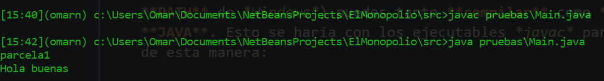

## Creación del proyecto "ElMonopolio" en NetBeans
Lo primero de todo es crear el proyecto en *NetBeans* para una mejor organización de los paquetes y archivos con los que trabajemos en un futuro. El propio *NetBeans* te realiza esta operación completamente solo y eliminando ciertas preocupaciones.

Al pulsar la función de crear proyecto se nos abrirá una interfaz donde nos darán a elegir las opciones óptimas para nuestro proyecto.

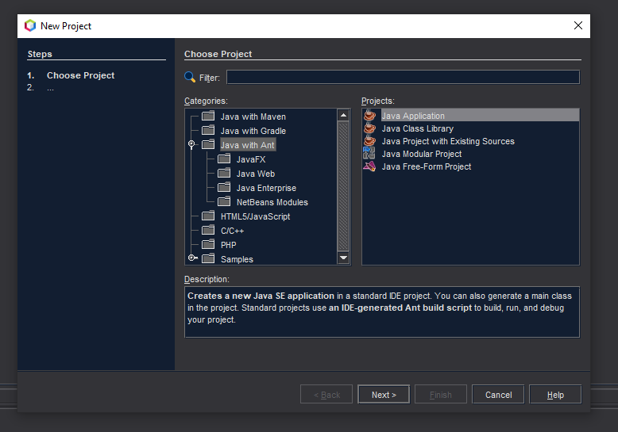

Podremos nombrar nuestro proyecto

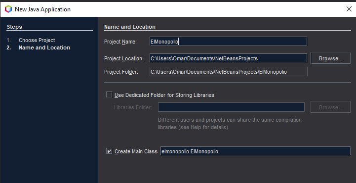

Creará un archivo inicial con ciertos metadatos. 

No lo usaremos

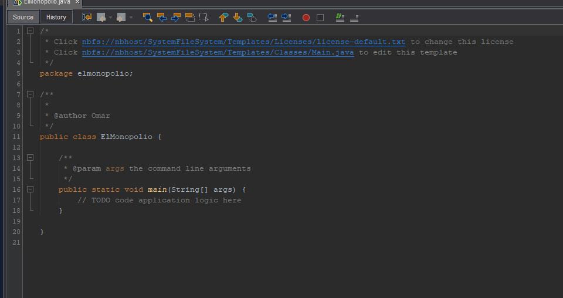

Se nos habrán creado los directorios y archivos con los paquetes necesarios

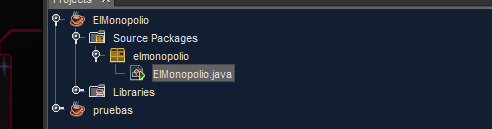

Ya estaríamos listos para comenzar con nuestro proyecto.

# Creación de clases
## Introducción
Lo primero que haré será crear la mayoría de **clases** necesarias a lo largo del desarrollo, tanto del propio juego (clases de *casilla*, *jugador*, etc.) como de algunos controladores cuya función explicaremos en su momento. En el módulo IAW, *Implementación de Aplicaciones Web* hemos visto y practicado con la creación de clases; sin embargo, veremos que necesitaremos llevar a cabo procedimientos más complejos de los vistos en el módulo, tocando temas como la **herencia** o la **privacidad** más a fondo. Para manejarnos con más soltura me he hecho con varios archivos teóricos sobre clases avanzadas en *JAVA*. Uniendo esto al hecho de que mi amable amigo, aquel que estaba estudiando *Ingeniería Informática*, siempre está dispuesto a ayudarme y explicarme lo que no entienda; dudo que haya algún prblema durante el desarrollo de las clases.

Es importante recalcar que crearemos la mayoría de las clases, no todas. Es decir, más adelante tendremos que crear las restantes.

Para la creación de estas clases seguiremos obviamente un orden. Debido a que ciertas clases que creemos serán hijas de otras, tendremos que identificar las **clases padres**, y crear las **hijas** a partir de estas.

Hay que decir que en *JAVA*, para aquellos que no han tenido contacto con el lenguaje puede parecer algo complejo, pero en realidad es bastante parecido a la mayoría de lenguajes, a pesar de que visualmente parezca un gran embrollo.

## Prueba *Parcelas*
Antes de crear las clases de *El Monopolio*, practicaré creando una clase llamada *Parcela* para intentar aprenderme bien la estructura para crear las clases durante el proyecto, aumentando la eficacia y reduciendo riesgos en el futuro.

### Creación de la clase *Parcela*

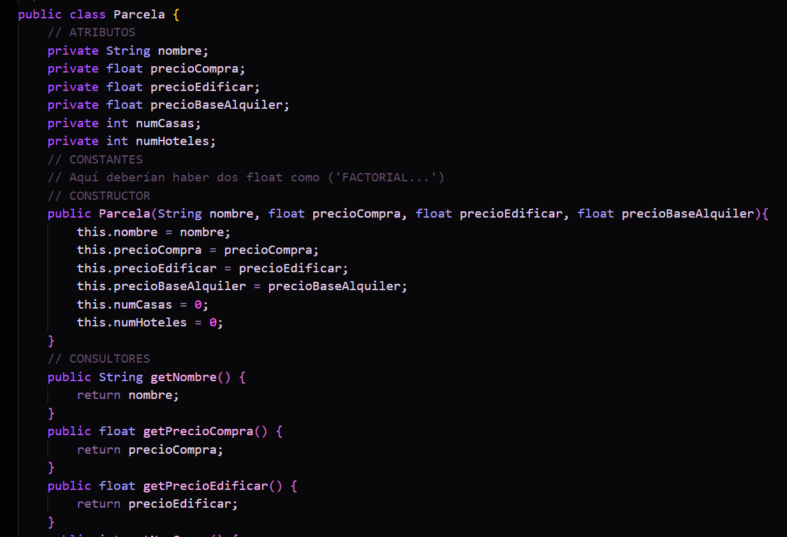

Más o menos, la organización de la clase será así:
- Atributos
- Constantes
- Constructor
- Consultores
- Otros métodos
  

### Inicialización de objeto *Parcela1* de clase *Parcela*
Cuando hube terminado el archivo de creación de la clase, mi objetivo era aprender a **inicializar** un objeto de esa clase. Pero viendo ejemplos había ciertos términos que no entendía. Recordemos que soy absolutamente nuevo en *JAVA*, y por lo tanto debería empezar a entender la metodología básica. El ejemplo que vi era este:

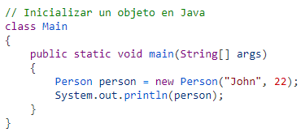

Lo primero que me extrañó fue que se creaba una clase llamada *Main*, y dentro de esa clase un **método estático** también llamado *main* que no devolviese nada, es decir, de tipo *void* (esto si que tiene sentido, aquí dentro es donde se supone que vamos a desarrollar nuestro código principal) y como parámetros un **array de strings** llamado *args*.
- Porque se crea la clase *Main*:
- Porque se crea la función estática llamada *main*:
- Porque le ponemos como parámetro un array de strings llamado *args*:
    La función *Main* puede tener parámetros, los cuales los introducimos por la terminal tras el nombre del propio archivo del código. En la variable *args* se guarda el array, cuyos elementos son:
    1. El propio nombre del archivo
    2. Primer parámetro
    3. Segundo parámetro
    4. ...

Otra duda que tenía era como íbamos a usar el código referido a una clase que estuviese en un archivo, para crear un objeto de dicha clase en otro archivo. Lo que he descubierto es que si está todo en el **mismo paquete**, perfectamente están **conectados**, así que no hay problema.

Entonces empecé a inicializar el objeto *parcela1* en otro archivo (en el mismo paquete) de esta manera:

Además en el mismo Main vamos a enseñar varios de los atributos que le hemos dado en el constructor.

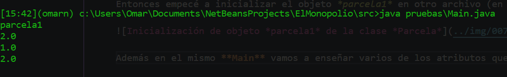

## Clases del propio juego.
Hecho la prueba de parcelas, me vi con la suficiente capacidad como para comenzar a crear las clases que sí que voy a usar para el desarrollo de *El Monopolio*. Sin embargo, como es natural en este ámbito, me encontré con otro problema: yo tengo todas las clases en el paquete clases y el resto de código en el paquete elmonopolio, así que tengo que encontrar la forma de **unir los paquetes**. Al parecer con la instrucción *import* puedes unir los paquetes fácilmente:

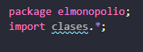

### Clase *Casilla*
Esta clase tiene la responsabilidad de representar las casillas del juego, recibir a los jugadores y aplicarles a estos lo que le corresponda según la **situación** del jugador y la casilla en el momento en que un jugador cae en esta.

Lo primero que haremos serán los atributos de instancia o dicho de otra manera propiedades:
- ***tipo* del tipo *TipoCasilla***. Puede ser *calle*, *tesoro* o *sorpresa*
- ***nombre* del tipo *String***. Nombre de la casilla
- ***precioCompra* del tipo *float***. Precio de pasar esta casilla a las *propiedades* de un *Jugador*
- ***precioEdificar* del tipo *float***. Precio de comprar una *casa* u *hotel*.
- ***precioBaseAlquiler* del tipo *float***. Para luego calcular el precio de *alquiler* según la cantidad de construcciones de la *Casillas*
- ***numCasas* del tipo *int***. Cantidad de *casas* en la *Casilla*
- ***numHoteles* del tipo *int***. Cantidad de *hoteles* en la *Casilla*
- ***propietario* del tipo *Jugador***. El *Jugador* que añadió esta *Casilla* a sus *propiedades* 
- ***mazo* del tipo *MazoSorpresas***. El *mazo* desde el cual obtendremos las *cartas Sorpresa*.
- ***sorpresa* del tipo *Sorpresa***. La propia *carta Sorpresa* si el *tipo* de *Casilla* fuese *SORPRESA*.

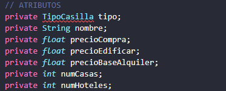

Como no existe el tipo *TipoCasilla* tendremos que crearlo, para ello necesitamos crear otro archivo llamado *TipoCasilla.java* también en el paquete *clases* para crear el **tipo enumerado**. El archivo tendría este formato:

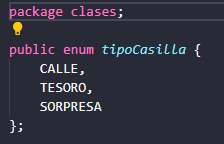

Luego crearemos dos constantes:
- *ALQUILERCALLE* del tipo *float*: factorial que marca el valor del alquiler por **calle** (x1)
- *ALQUILERCASA* del tipo *float*: factorial que marca el valor del alquiler por **cada casa** (x1)
- *ALQUILERHOTEL* del tipo *float*: factorial que marca el valor del alquiler por **hotel** (x4)

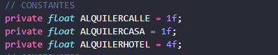

Ahora crearemos un inicializador para asignar como valor inicial 0 tanto a *numCasas* como a *numHoteles*. Este inicializador lo usaremos en los tres constructores que haremos: uno por cada *tipo* de *Casilla*. El constructor de las casillas tipo *DESCANSO* tendrá solamente el *nombre* de la casilla como parámetro; el constructor de las casillas tipo *SORPRESA* tendrán como parámetros tanto el *nombre* como el *mazo*; y por último la casilla tipo *CALLE* tendrá como parámetros el título de la calle y los precios de compra, de edificar y de alquiler.

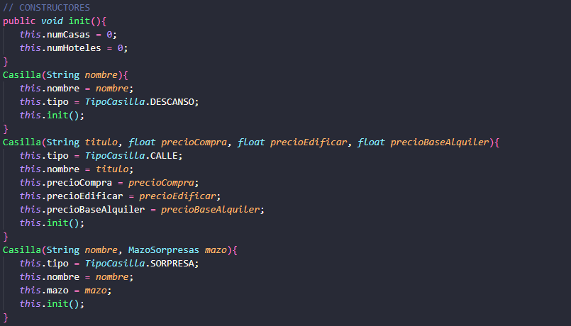

Luego crearemos los clásicos **consultores** de todas las propiedades excepto el *precioAlquilerBase*, porque en este caso, en vez de enseñar este atributo (que simplemente nos sirve de referencia) enseñaremos el *precioAlquilerCompleto* (que es el **precio real** adaptado a cada casilla y su situación)

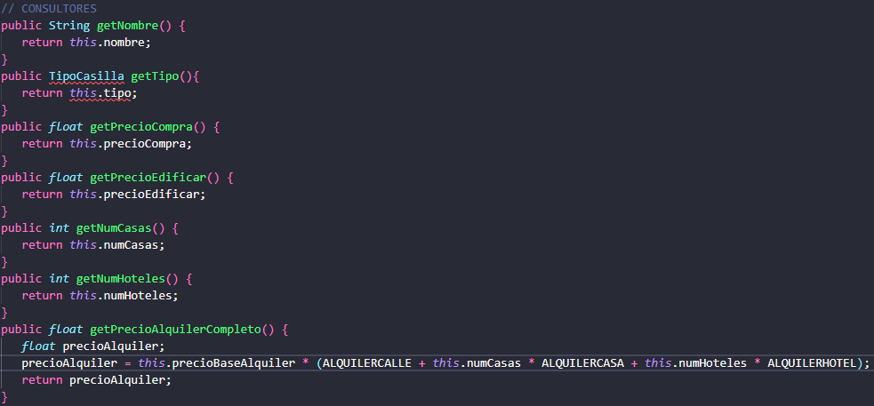

// cosa

Crearemos el método **tramitarAlquiler()** que efectúa la acción de **cobrar** el alguiler a un jugador y **pagárselo** al propietario de la *Casilla*. En este método controlaremos que la *Casilla* efectivamente tiene *propietario* con el método **tienePropietario()**, y que el *Jugador* pasado como parámetro (es decir el que ha caído en la *Casilla*) no es dicho *propietario* con el método **esEsteElPropietario()**, ya que si es así, este *Jugador* tendrá que pagar el precio del alquiler, definido mediante el método consultor **getPrecioAlquilerCompleto()**.

Crearemos también el método **derruirCasas()**, que como el propio nombre indica, sirve para reducir el valor de *numCasas*. Controlaremos mediante el método **esEsteElPropietario()** que el jugador pasado como parámetro sea el propietario de la *Casilla*, porque si no lo es no puede ni edificar ni derruir nada aquí; y además controlaremos que el número de casas a derruir pasado como parámetro es menor o igual a la cantidad de casas que hay en la *Casilla*, por razones obvias.

//cosa

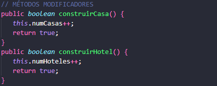

Crearemos los dos métodos controladores usados anteriormente: **esEsteElPropietario()**, que lo que hará será devolver si el *Jugador* pasado como parámetro (el posicionado en esta *Casilla*) es el mismo que el Jugador del atributo *propietario*; y **tienePropietario()**, que devolverá si el atributo *propietario* tiene o no algún valor.

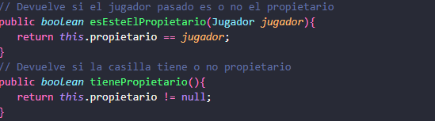

Y para finalizar crearemos otros dos métodos. 

El primero de ellos será el **informe()** que guardará un evento en el *Diario* que indique que *Jugador* acaba de pasar por la *Casilla* en cuestión.

El segundo, **toString()** será simplemente un método que devuelva una cadena de texto con toda la información referida a la instancia de la *Casilla* en cuestión.

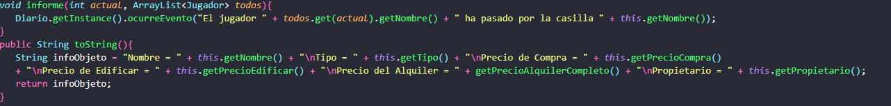

### Clase *Tablero*
Esta clase tiene la responsabilidad de representar el tablero de juego imponiendo las restricciones existentes sobre el mismo en las reglas de juego.

Los atributos de instancia de la clase *Tablero*:
- *casillas* de tipo *ArrayList* de *Casilla*, que contendrá una lista con los objetos creados de la clase *Casilla* (es decir las propias casillas).
- *porSalida* de tipo *booleano*, que señalará si se ha pasado por la *Casilla de Salida*.

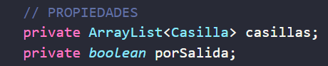

Tendrá un constructor sin parámetros donde inicializaremos ambas propiedades. Al atributo *casillas* le introduciremos un elemento que será la *Casilla de Salida*, que será un objeto  de la clase *Casilla* que inicializaremos usando el constructor correspondiente.

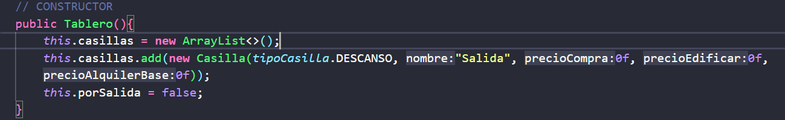

Por último crearemos varios métodos:
- El método **correcto()** devolverá true si el parámetro introducido existe como índice dentro del array *casillas*, es decir si el índice de la casilla es mayor a la cantidad de entradas que tiene la lista de casillas quiere decir que el ínidice no es correcto.
- El método **computarPasoPorSalida()** procesará y devolverá el valor del atributo *porSalida* y lo dejará de nuevo en false. Así este método valdrá *true* siempre que el atributo *porSalida* valga *true*; es decir este método valdrá *true* siempre que alguien haya pasado por la casilla de salida. Se vuelve a poner en *false* para que los siguientes jugadores puedan también pasar por ella.
- El método **añadeCasilla()** introducirá el objeto de la clase *Casilla* que introduzcamos como parámetro en el array *casillas*. Es decir, lo añadirá al *Tablero*.
- El método **getCasilla()** nos devolverá el elemento del array *casillas* cuyo índice sea el introducido como parámetro. En el caso en el que no exista ese índice, devolverá null.

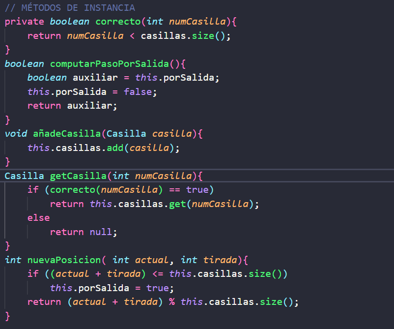

### Clase *Diario*
Esta clase nos servirá para definir un **único objeto** que tendrá como **único atributo de instancia** un Array donde se guardarán todos los eventos del juego que estén sucediendo y los enseñe. Por ejemplo, si un jugador ha pasado por la *Casilla de Salida*, este objeto guardará una **cadena** en el Array del tipo: *El jugador X ha pasado por la Casilla de Salida*.

Como dije antes, el único objeto de esta clase solo tendría un atributo de instancia llamado *eventos* donde se va a guardar una lista con los eventos que vaya ocurriendo a lo largo de la partida en formato *String*.

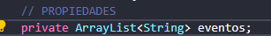

A continuación crearemos un atributo de clase llamado *instance* donde se **inicializará** el objeto, indicando con final que solo esta propiedad solo tendrá el valor que le asignemos. Y le asignaremos la inicialización del objeto, es decir, no se podrá volver a inicializar un objeto de esta clase. A este modelo le estoy llamando *Singleton*.

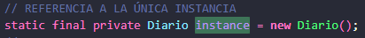

Crearemos el **constructor** que inicializará la única propiedad del objeto.

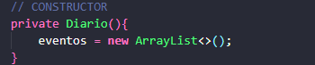

Crearemos un simple método para **devolver** el objeto que hayamos inicializado con el anterior atributo de clase *instance*:

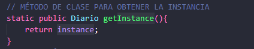

Y para finalizar le crearemos varios métodos con diferentes funciones:
- El método **ocurreEvento()** simplemente añadirá una cadena introducida como parámetro al array *eventos*.
- El método **eventosPendientes()** devuelve *true* si el array *eventos* no está vacío. 
- El método **leetEvento()** devuelve el primer elemento del array *eventos* y lo borra.

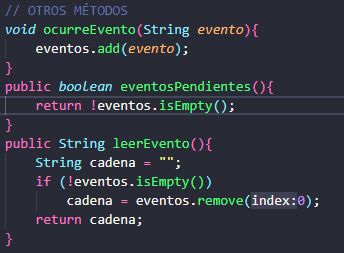

### Clase *Dado*
Esta clase tiene la responsabilidad de encargarse de todas las decisiones del juego que están relacionadas con el **azar**, incluidas las relacionadas con el avance del jugador. Al igual que en la clase *Diario*, aquí solo definiremos solamente un objeto.

Sus atributos de instancia son:
- *random* de tipo *Random*, que es una clase incluida en las librerías *java.util*.
- *ultimoResultado* de tipo *int*.
- *debug* de tipo *booleano*, que es donde guardaremos el **estado del dado** (el estado *debug* sirve para depurar errores).

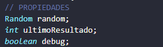

Tendrá un atributo de clase donde definiremos el **único objeto** de la clase *Dado*. Usaremos exactamente el mismo formato que usamos en la clase *Diario*.

Además tendrá dos constantes que nos servirán más tarde para definir cuantos valores tiene el *dado* tanto en el modo *debug* como en el modo normal. En el modo *normal* serán 6 valores posibles como era de esperar, pero en el modo *debug* siempre dará como resultado un 1.

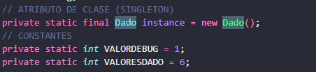

En el **constructor** inicializaremos todos los atributos de instancia de esta clase. Como valores por defecto ponemos que *ultimoResultado* valga 0 y que el **estado del dado** no esté en *debug* (es decir '*debug=false*'). Para la propiedad *random* tendremos que inicializarla como objeto de la clase *Random* de *java.util*, para poder usar los métodos que pone esta clase a nuestra disposición.

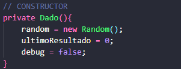

Creremos también varios **consultores**, uno para la propia instancia creada (será un método de clase) y otro que devuelva el valor del atributo *ultimoResultado*.

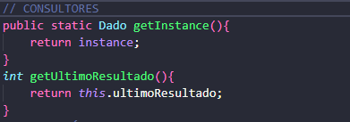

A parte crearemos los siguientes métodos:
- *tirar()* nos devolverá una tirada del dado, un número comprendido entre **el 1 y el 6**. Si el modo debug está activado (es decir, el atributo *debug* tiene como valor *true*), las tiradas siempre serán **de 1 en 1**, así que *tirar()* siempre devolverá 1. Esto es para **detectar fallos** en las casillas u otros.
- *quienEmpieza()* devuelve un entero aleatorio entre 0 y un número introducido como parámetro que representará la cantidad de jugadores. El número que devuelva representa el índice de algún **jugador** en un array con los jugadores.
- *setDebug()* cambia el valor de *debug* al introducido como parámetro y guarda un string como un elemento de la lista de *eventos* de la clase *Diario* informando del estado de *debug*.

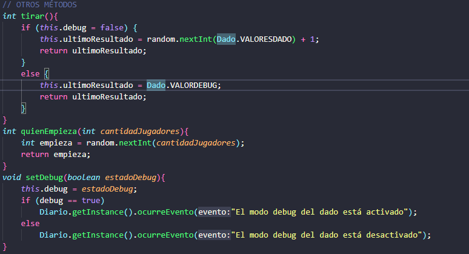

### Clase *MazoSorpresas*
Esta clase representa el mazo de cartas *sorpresa*. Además de **almacenar** las cartas, las instancias de esta clase velan por que el mazo se mantenga **consistente** a lo largo del juego y para que se produzcan las operaciones de barajado cuando se han usado ya todas las cartas.

Deberemos crear una clase llamada *Sorpresa*, pero de momento puede estar vacía.

Las propiedades de instancia de la clase *MazoSorpresas* son:
- *sorpresas* que será un array de tipo *Sorpresa* (los elementos solo pueden ser instancias de la clase *Sorpresa*).
- *barajada* será de tipo *booleano* y determinará si el mazo ha sido barajado (*true*) o no (*false*).
- *usadas* de tipo *int* determinará cuantas cartas se han utilizado tras haber barajado el mazo. 
- *debug* de tipo *booleano* que indica si el *modo debug*.

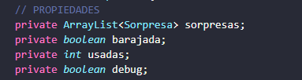

Crearemos un método inicializador que de valores iniciales a los atributos de instancia *sorpresas*, *barajada* y *usadas*. Luego usaremos este método en los constructores para inicializar completamente la instancia. 

Habrá 2 constructores:
- El primero **no tiene parámetros** y simplemente llama al inicializador (para inicializar los 3 atributos mencionados) y además le asigna *false* al atributo *debug*.
- El segundo tiene como parámetro **un valor de tipo booleano** que si es *true* es asignado a *debug* y crea un *evento* para la clase *Diario*. Además llama al método inicializador anterior.

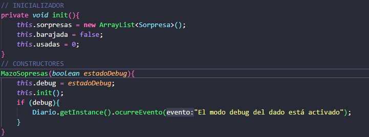

A parte crearemos otros 2 métodos:
- *alMazo()* añade una instancia de la clase *Sorpresa* (es decir una carta de sorpresa) al array del atributo *sorpresas* (es decir al mazo de sorpresas).
- *siguiente()* lo que hace es sacar una carta del principio del mazo, devolverla y volverla a introducir al final. Además controla que en el caso de que ya hayamos usado todas las cartas del mazo este se baraje (a no ser que esté en *modo debug*).

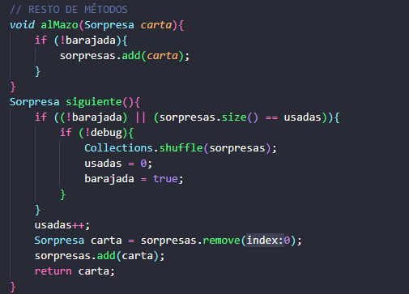

### Clase *Sorpresa*
La clase *Sorpresa* definirá las características principales de cada *carta de sorpresa* que creemos. Además se encargará de aplicar los efectos en los *Jugadores* a las que les toquen dichas cartas. En esencia las cartas simplemente tendrán un valor negativo (a pagar) o un valor positivo (a cobrar). Hay dos tipos de cartas: las *PAGARCOBRAR* son sencillamente que el *Jugador* cobra o paga el valor de la carta; por otro lado, las *PORCASAHOTEL* son que el *Jugador* cobra el valor de la carta multiplicado por las casas y hoteles que tenga en su propiedad. Estos tipos están definidos en el mismo paquete en el archivo **TipoSorpresa.java**

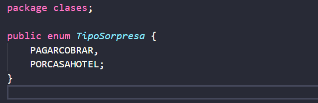

Las propiedades de *Sorpresa* serán:
- *texto* de tipo *String*. Aquí definiremos la descripción de la carta de sorpresa.
- *valor* de tipo *int*. Este será el valor a modificar del saldo del Jugador al que se le aplica la carta.
- *tipo* de tipo *TipoSorpresa*. El tipo de sorpresa (*PAGARCOBRAR* o *PORCASAHOTEL*).
- *mazo* de tipo *MazoSorpresa*. El *mazo* al que pertenece la carta.

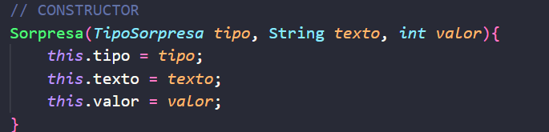

El constructor inicializará los atributos tal cual como se hace normalmente: introduces los valores como parámetro y se los asignas a las propiedades.

Crearemos dos métodos, uno por cada tipo de sorpresa. Para el tipo *PAGARCOBRAR* haremos el método **aplicarAJugador_pagarCobrar()** que use el método **modificaSaldo()** de la instancia del jugador indicado por los parámetros introducidos (el entero introducido es el índice del jugador en el array introducido como segundo parámetro). A **modificaSaldo()** le introducimos como parámetro el *valor* de la carta. Para el tipo *PORCASAHOTEL* crearemos **aplicarAJugador_porCasaHotel()** que es exactamente igual pero antes multiplicamos el *valor* de la carta por la cantidad de casas y hoteles que tenga el jugador. Para ello usaremos el método de la instancia del *jugador* **cantidadCasasHoteles()** que te suma cuantas casas y hoteles tiene el jugador.

A parte crearemos un método más, el método **aplicarAJugador()** que llamará a cualquiera de los otros dos anteriores según de que tipo sea la carta. Así, nosotros solo tendremos que llamar a este método para que se ajuste al tipo de sorpresa de la instancia de *Sorpresa*, es decir de la carta sorpresa que ha tocado.

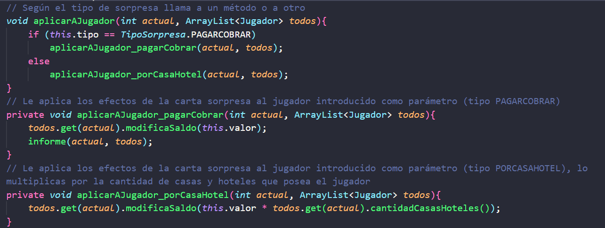

Para finalizar crearemos otros dos métodos. Estos los hemos creado también en otras clases, pero si os fijáis bien, cambian y se adaptan según la clase.

El primero de estos métodos es el de **informe()** que crea un evento en la instancia de *Diario* que informa a que jugador se le aplicará la sorpresa. El segundo y último método es **toString()** y devolverá solamente la descripción de la carta, es decir la propiedad *texto*.

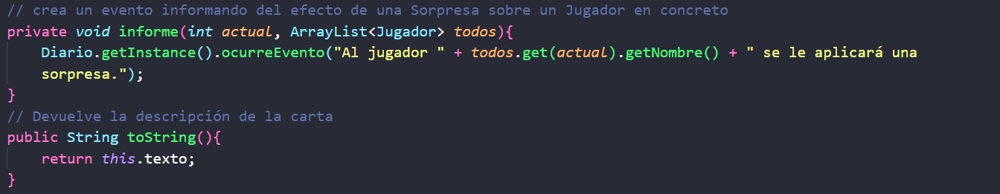

### Clase *Jugador*
En esta clase definiremos las características del Jugador, las propiedades que puede tener, las propiedades que ostenta y la cantidad de dinero que tiene. Además definiremos métodos que controlen o efectúen acciones sobre la construcción o destrucción de edificios, adquisición de propiedades y modificaciones en el saldo del Jugador.

Las propiedades de Jugador son:
- *casillaActual* de tipo *int*, que indica el índice de la *Casilla* en la que se encuentra el personaje en el array del *Tablero*.
- *nombre* de tipo *String*. El propio nombre del *Jugador*.
- *puedeComprar* de tipo *booleano*, que indica si el Jugador puede o no comprar la Casilla en la que está posicionado. Eso está medido por los métodos de control de esta clase.
- *saldo* de tipo *float*, que indica la cantidad de dinero que posee el Jugador a lo largo de la partida. Aquí se le sumaran los ingresos y restaran los gastos.
- *propiedades* de tipo *Array de Casillas*, que es una lista de instancias de la clase *Casilla* que representa la cantidad de propiedades que tiene el Jugador.

A parte tiene diferentes atributos de clase que se le atribuirán a todas las instancias u objetos de la clase Jugador:
- *CasasMax* de tipo *int* y con valor **4**, define la cantidad máxima de casas que pueden estar construidas sobre una Casilla.
- *CasasPorHotel* de tipo *int* y con valor **4**, define la cantidad de casas que debe haber construidas antes de sustituirlas por un hotel.
- *HotelesMax* de tipo *int* con valor **4**, indica la cantidad máxima de hoteles que puedn estar construidos sobre una misma Casilla.
- *PasoPorSalida* de tipo *float* con valor **1000**, indica la aportación a recibir por un Jugador tras pasar por la *Casilla de Salida*.
- *SaldoInicial* de tipo *float* con valor **7500**, indica la cantidad de dinero con la que los Jugadores comienzan la partida.

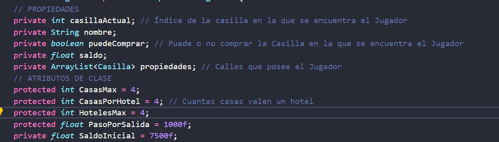

Esta clase tiene varios constructores. El primero pide como parámetro el nombre que querramos ponerle al Jugador e inicializa el resto de atributos con valores por defecto o valores de clase como es el caso del **saldo inicial**. El segundo constructor pedirá y **copiará** el objeto de tipo Jugador pasado como parámetro, inicializando así de nuevo un objeto de tipo Jugador igual al pasado como parámetro.

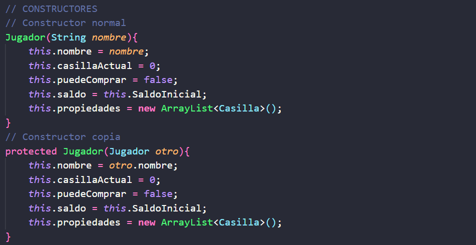

Crearemos los consultores correspondientes a la clase *Jugador*.

Crearemos el método consultor **cantidadCasasHoteles()** que nos devuelva un entero equivalente a la cantidad casas u hoteles que posee el Jugador. Para ello, con el equivalente al *foreach* de *PHP* en *JAVA*, el *for(:)* recorreremos el array *propiedades* que es donde se guardan todas las Casillas que posee el Jugador, y por cada una de los objetos *Casilla* que haya, llamaremos al método **cantidadCasasHoteles()** de la clase *Casilla* y sumaremos esa cantidad a la variable *cantidad* que más tarde devolveremos. Es decir, contaremos cuantas casas u hoteles hay por cada casilla que posea el jugador y devolveremos el total.

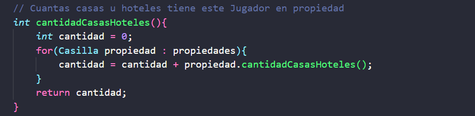

Crearemos el clásico método **toString()** para devolver una cadena de texto con info sobre el Jugador en cuestión. 

Crearemos el método **moverACasilla()** que como su nombre indica, su función es mover al jugador de la casilla donde está actualmente a la pasado por parámetro (se pasará un entero que será el índice de la *Casilla* en el *Tablero*). Además tiene otras funciones: le asigna *false* a *puedeComprar* por si en la casilla anterior este atributo estaba en *true*, es decir, si en la casilla actual se comprobó que el Jugador podía comprarla el atributo lo indicará; pero en la siguiente casilla a la que se mueva deberá no poder comprarse hasta que se compruebe que es posible mediante otros métodos. Y además creará un evento en *Diario* informando sobre el *Jugador* que se haya movido a la *Casilla*.

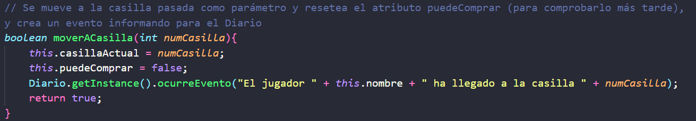

Ahora vamos a elaborar unos cuantos métodos que serán los que se encargarán de modificar el *saldo* al Jugador. Serán cuatro, y el más importante y elaborado de todos será el primero: **modificaSaldo()**. Este método se encargará de **sumarle** al saldo del jugador la cantidad recibida como parámetro. Siempre será una suma, con los métodos siguientes pasaremos la cantidad a negativa para que dicha suma se efectúe como una reducción en el valor del saldo si así lo necesitamos.

Los dos siguientes métodos son bastante simples. El primero de ellos, **recibe()** simplemente lo que hace es llamar a **modificaSaldo()**. Parecerá una tontería crear un método que simplemente llame a otro método, pero la verdad es que te simplifica muchísimo el entendimiento y la funcionalidad de cambiar el saldo a un Jugador, ya que cuando llamamos a estos métodos desde otras clases es más fácil entender su significado. El segundo método, **paga()** hace lo mismo que el anterior pero multiplicando el valor por **-1**, es decir pasándolo a negativo. Si te das cuenta, el nombre de estos dos métodos son bastante descriptivos. En vez de llamar a **modificaSaldo()** llamaremos a **paga()** o **recibe()** según la situación de la partida.

Hay un método más, el método **pagaAlquiler()** que servirá para cuando el jugador caiga en los dominios de otro jugador. Simplemente llama al método **paga()** y le da como parámetro el suyo propio.

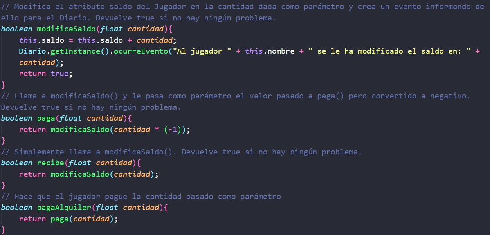

De forma adicional a las anteriores, hemos creado un método llamado **pasaPorSalida()** que lo que hace es llamar al método **recibe()** y pasándole como parámetro el atributo de clase *PasoPorSalida*. Básicamente lo que hace este método es hacer que la cantidad asignada al paso por la salida se le sume al saldo. Además, creará un evento en el Diario informando de esto y devuelve true.

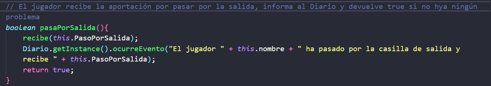

Crearemos un método llamado **puedeComprarCasilla()** que lo que hará es simplemente habilitar la opción al jugador de comprar la casilla. No controlará nada, pues eso se hará en otro método. Es bastante simple la metodología, lo único que haremos es asignarle el valor *true* a el atributo *puedeComprar* y devolverlo.

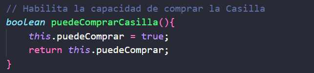

// cosa

A continuación crearemos una serie de métodos que se encargarán sobre todo de controlar ciertos aspectos relacionados con las propiedades del Jugador. Comenzaremos explicando varios bastante básicos. Los métodos **puedoEdificarCasa()** y **puedoEdificarHotel()** controlan que el precio de edificación de la *Casilla* pasada como parámetro no es superior al saldo del Jugador que quiere edificar, esto mediante el método **puedoGastar()**, este método solo devuelve true cuando un precio introducido como parámetro no es mayor al atributo *saldo* del *Jugador*. Los métodos **puedoEdificarCasa()** y **puedoEdificarHotel()** no solo controlan si el Jugador se puede costear las construcciones, por un lado el método **puedoEdificarCasa()** controla que no has llegado al límite de casas que puedes contruir por Casilla mientras que por orto lado el método **puedoEdificarHotel()** hace lo mismo con los hoteles pero junto a eso también controla que hay las suficientes casas como para sustituirlas por un hotel.

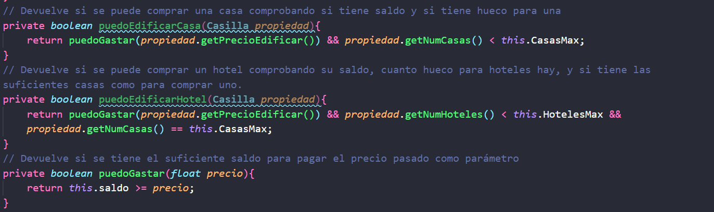

No son los únicos métodos controladores que tiene esta clase. *Jugador* también posee métodos que controlan si el Jugador se ha quedado sin dinero, otro que controla si el jugador tiene *Casillas* en propiedad, etc.

El que controla que el *Jugador* en cuestión se ha quedado sin dinero se llama **enBancarrota()** y simplemente devuelve true cuando el atributo *saldo* es menor a 0. Cuando un Jugador entra en Bancarrota el juego termina, así que para descubrir quien ha sido el Jugador es el ganador tenemos que sacar aquel que tiene el mayor valor en el atributo *saldo*, es decir, aquel que tenga la mayor cantidad de dinero. Para resolver parcialmente esta cuestión crearemos un método llamado **compareTo()** que habrá estado definido en una interfaz de *JAVA* llamada *Comparable*, es decir estamos heredándolo, y como queremos sobreescribir su contenido escribiremos justo encima la sentencia **@override**. Este método simplemente llamará a otro método de la clase *Float* también incluido en librerías en *JAVA*, este método es **compare()** al que le pasas como parámetros los saldos de este Jugador y de otro y te devolverá un entero indicando cual es el mayor.

De forma adicional a estos métodos tenemos otros dos que controlan ciertos aspectos con respecto a las propiedades de un Jugador. El método **tieneAlgoQueGestionar()** lo que hace es devolver true siempre y cuando el atributo *propiedades* no esté vacío, que recordemos que este atributo es un array donde se guardan *Casillas* que durante la partida hayan sido adquiridas por el *Jugador* en cuestión. El otro método es **existeLaPropiedad()** y controla que el índice introducido como parámetro existe en el array de *Casillas* comentado antes, llamado *propiedades*.

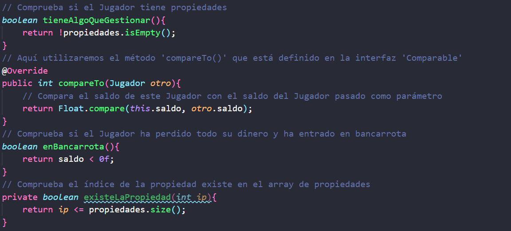

### Clase *GestorEstados*
Esta clase se encarga de controlar los estados del turno teniendo en cuenta factores como las operaciones del turno, como pueden ser avanzar, comprar o pasar turno (están definidos en el tipo enumerado *OperacionesJuego*). Los estados del juego también están definidos en un tipo enumerado llamado *EstadoJuego*. Esta clase es bastante sencilla, aunque en la foto parezca más compleja de lo que realmente es.

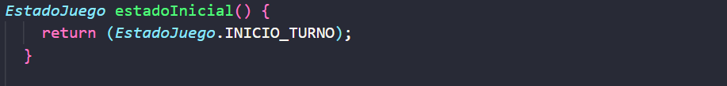

Tiene varios métodos. El primer método se llama **estadoInicial()** y simplemente lo que hace es devolver el estado de juego *INICIO_TURNO*. Luego el método **siguienteOperacion()** devuelve la operación que correspondería con el estado actual, pero controlando que se dan las características necesarias para ello:
1. **INICIO_TURNO**. Cuando estás en el inicio de turno lo único que puedes hacer es avanzar, así que se devuelve **AVANZAR**.
2. **DESPUES_AVANZAR**. Justo después de avanzar tienes varias opciones:
  - **COMPRAR**. Si puedes comprar la casilla actual usando el método **getPuedeComprar()**.
  - **GESTIONAR**. Si tienes casillas entre tus propiedades, usando el método **tieneAlgoQueGestionar()**.
  - **PASAR_TURNO**. Si no puedes realizar ninguna de las anteriores operaciones.
3. **DESPUES_COMPRAR**. Justo depués de comprar solo podrás hacer dos operaciones:
  - **GESTIONAR**. Si tienes casillas entre tus propiedades, usando el método **tieneAlgoQueGestionar()**.
  - **PASAR_TURNO**. Si no puedes realizar ninguna de las anteriores operaciones.
4. **DESPUES_GESTIONAR**. Después de gestionar tus propiedades (si las hubieses tenido) se puede dar por concluído el turno, así que solo podremos devolver **PASAR_TURNO**.

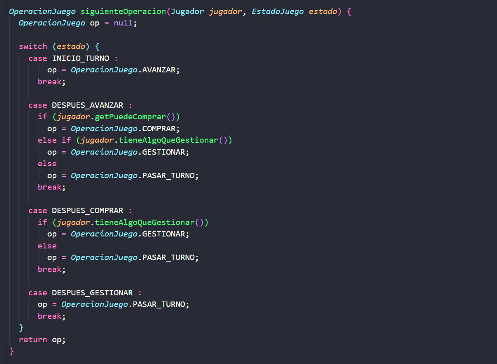

Luego tenemos un método llamado **siguienteEstado()** que simplemente devuelve el siguiente estado al actual según la operación actual. Además informa del estado y la operacion creando un evento en el *Diario*.

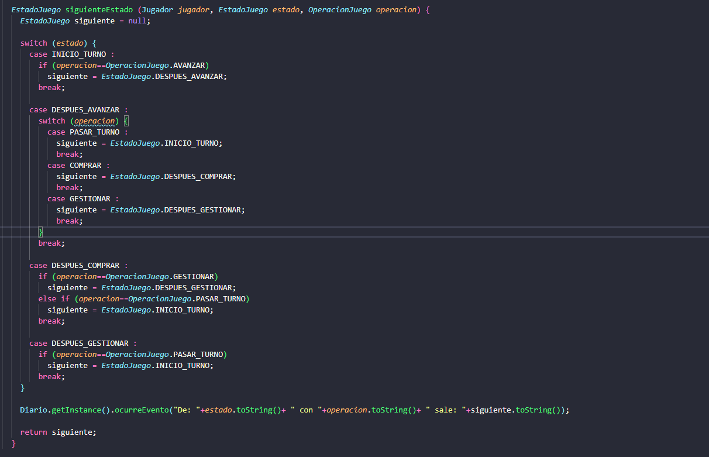

### Clase *MonopolioJuego*
Esta clase es la principal ya que será donde implementaremos la mayoría de métodos creados durante el proyecto, donde inicializaremos todas las *Casillas* y las cartas *Sorpresa*, donde se guardarán los *Jugadores* que formarán parte de la partida, donde se incializará el *MazoSorpresas* y el *Tablero*, se computarán compras y pasos de turno, etc. Es la clase que define la partida, en resumidas cuentas. *MonopolioJuego* tiene como propiedades de instancia:
- *indiceJugadorActual* de tipo *int*. Indicará el índice del *Jugador* en la lista *jugadores* que está jugando en este turno.
- *jugadores* de tipo *array de Jugador*. La lista mencionada en la propiedad anterior, es donde se guardan los jugadores que están formando parte de la partida actual.
- *estado* de tipo *EstadoJuego*. En cada turno hay cuatro partes importantes: el inicio del turno, después de avanzar, después de comprar y después de gestionar. Estos estados del juego están definidos en el tipo enumerado *EstadoJuego*.
- *gestor* de tipo *GestorEstados*. Es una instancia de la clase *GestorEstados* que se encarga de pasar de *estado* según las operaciones realizadas durante el turno, definidos en el tipo enumerado *OperacionJuego*, definido también en su propio archivo.
- *mazo* de tipo *MazoSopresas*. Es una instancia de la clase *MazoSopresas* que define básicamente el mazo que su usará durante la partida.
- *tablero* de tipo *Tablero*. Es una instancia de la clase *Tablero* que define el tablero que se usará durante la partida.

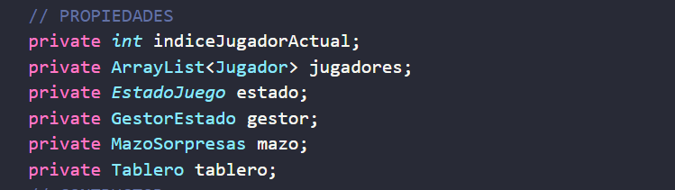

El constructor de esta clase es bastante más complejo que lo que hemos visto anteriormente. Es únicamente uno, pero se encarga de inicializar muchas instancias que necesita la partida para construirse de forma correcta. Los únicos parámetros que tendrá el constructor será un *array de tipo String* con los nombres de los jugadores, y un *booleano* que determinará si la partida será en modo *debug* o no, por si queremos depurar errores.

Lo primero que hará el constructor es inicializar las instancias de la clase Jugador, es decir los jugadores. Esto lo haremos mediante la lista de nombres introducida como parámetro. Recorreremos este array mediante el bucle *for(:)* y por cada nombre de la lista llamaremos al constructor de *Jugador* y le pasaremos como parámetro dicho nombre. Adicionalmente, guardaremos dicha instancia en la lista de jugadores que tenemos como propiedad llamado *jugadores*.

Inicializaremos la instancia del gestor de estados o *GestorEstados* y la guardaremos en la variable *gestor*. A continuación usaremos un método llamado **estadoInicial()** para inicializar el atributo *estado*. Lo que habremos hecho es poner el estado de la partida en inicio de turno para que pueda comenzar la partida y entrar en los siguientes estados sin problemas.

El dado no tendremos que inicializarlo porque si recordamos bien, la instancia era única y ya se había instanciado en la propia clase Dado. Sin embargo, si tendremos que referenciarla para poder definir con que modo del dado queremos que comience la partida: modo *normal* o modo *debug*. Esto se haría llamando al método de la mencionada instancia del dado llamado **setDebug()** y pasándole como parámetro la variable *debug* pasada al contructor inicialmente.

Ahora, todavía dentro del constructor, usaremos el método **quienEmpieza()** de la instancia de *Dado*, una vez que ya tenemos a los jugadores en la lista de *jugadores* para elegir aleatoriamente quien va a ser el que comience la partida. Como va a ser el responsable de acometer las acciones del primer turno, su índice se lo asignamos al atributo *indiceJugadorActual* y así lo habremos incializado también.

Antes de acabar tendremos que instanciar la clase *Tablero* y la clase *MazoSorpresas* para poder inicializar tanto las *Casillas* como las cartas *Sorpresa*. Llamamos al contructor de la clase Tablero, y según si el parámetro *debug* esté en *true* o en *false* (es decir el modo debug activado o no), llamaremos a un constructor de *MazoSorpresas* encargado de inicializarlo en este modo o a otro que se encargue de inicializarlo sin él.

Por último llamaremos a los métodos **inicializarTablero()**, e **inicializarMazoSorpresas()** que es donde inicializaremos todas las *Casillas* y *Sorpresas* de la partida.

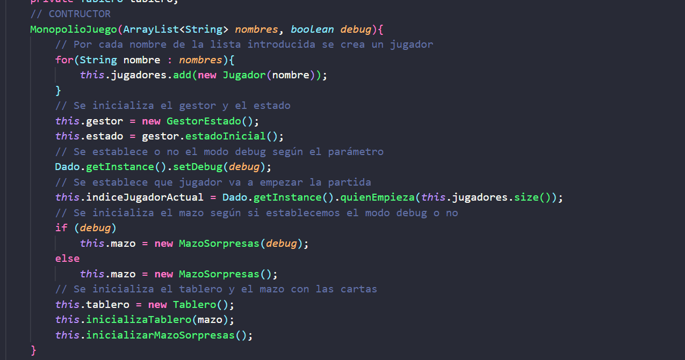

El método **inicializarTablero()** tomará como parámetro el atributo *mazo* inicializado en el contructor, y nos servirá para pasársela como parámetro al constructor de la *Casilla* encargado de las casillas de tipo sorpresa. Aunque parezca extenso el código, casi todas las líneas se repiten, esto es porque en cada línea habremos inicializado una *Casilla*. Pero no solo eso, si recordamos bien, en la instancia de *Tablero* teníamos una propiedad, llamada *tablero* también, que era un array donde guardábamos todas las casillas del tablero, pues ahora es el momento de añadirlas a dicha lista. Como hemos instanciado Tablero, podemos llamar a el método **añadeCasilla()** de dicha instancia y le pasaremos como parámetro el constructor (según el tipo de casilla que queramos) de la Casilla en cuestión y así la instanciaremos, creando un objeto de la clase Casilla y añadiéndola al objeto de clase *Tablero* a la vez, por cada Casilla. Al llamar a este método estaremos creando 19 casillas más la casilla de salida que estaba creada anteriormente, 15 de ellas serán calles, 3 serán sorpresas y 1 será descanso (2 contando la salida).

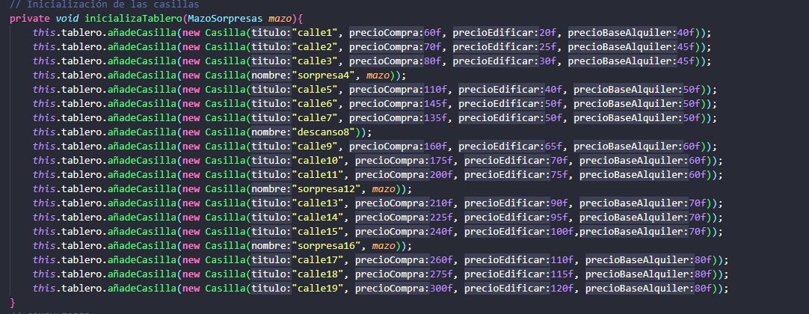

El método **inicializarMazoSorpresas()** tendrá más o menos el mismo formato que en **inicializarTablero()** pero no necesitaremos introducirle ningún parámetro. Por cada línea instanciaremos la clase *Sorpresa* con su contructor, y añadiremos el objeto creado al array de cartas de sorpresas *mazo*, que como es un objeto de la clase *MazoSorpresas* podremos usar su método **alMazo()** que sirve para lo comentado. Al llamar a este método habremos creado 10 cartas de sorpresa, 6 del tipo sencillo (3 buenas y 3 malas) con las que al jugador le afecta directamente el valor de la carta; y por otro lado, 4 del tipo multiplicado (2 buenas y 2 malas) con las que al jugador le afecta el valor de la carta de sorpresa multiplicado por la cantidad de edificios que tenga entre sus propiedades.

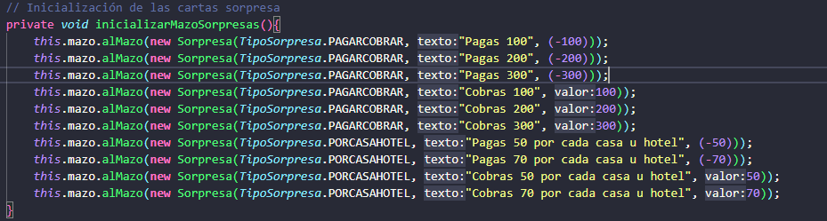

Crearemos varios consultores clásicos para devolver algunas propiedades de la clase. El que más nos importa es el método **getJugadorActual()** que devuelve el objeto de clase de *Jugador* que en la lista *jugadores* tiene el índice *indiceJugadorActual*.

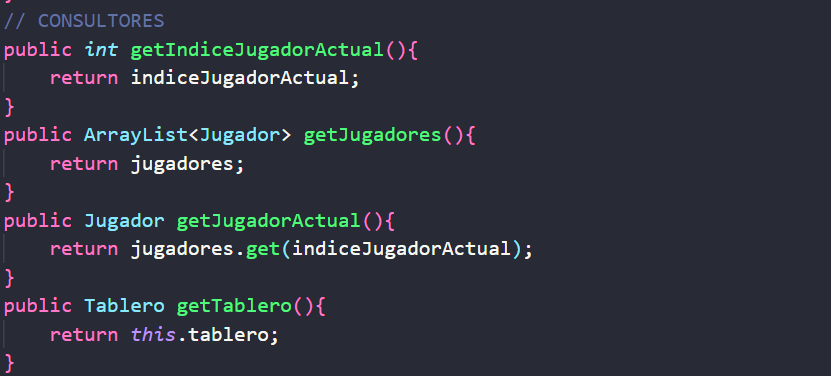

// cosa

Crearemos un método llamado **contabilizarPasosPorSalida()** que llama al método **pasaPorSalida()** del jugador que está jugando este turno, que si recordamos lo que hacía era darle el dinero correspondiente al paso por salida al jugador que hiciese tal acto. Para saber si alguien ha pasado por la salida llamaremos al método **computarPasoPorSalida()** del objeto de la clase *Tablero*, que devolverá *true* siempre que alguien haya pasado por la salida.

Crearemos un método centrado en pasarle el turno al siguiente jugador, teniendo en cuenta que si es el último jugador de la lista el turno pasará al primero. Este método se llama **pasarTurno()**.

// cosa

El método **siguientePasoCompletado()** llamará al método de **siguienteEstado()** del objeto instanciado de *GestorEstados*, y le pasaremos como parámetro el objeto Jugador que está jugando el turno, el estado del turno y la operación que será pasada inicialmente como parámetro.

// cosa

// cosa

Crearemos dos métodos llamados **construirCasa()** y **construirHotel()** que simplemente llamarán a sus homólogos en el objeto de la clase *Jugador* que tenga el turno. Así un jugador será capaz de construir casas u hoteles.

Y para finalizar la clase, crearemos un método llamado **finalDelJuego()** que comprobará mediante el método **enBancarrota()** del jugador actual si se ha quedado sin saldo, lo que significaría el final de la partida y el paso al ranking para ver quien es el ganador.

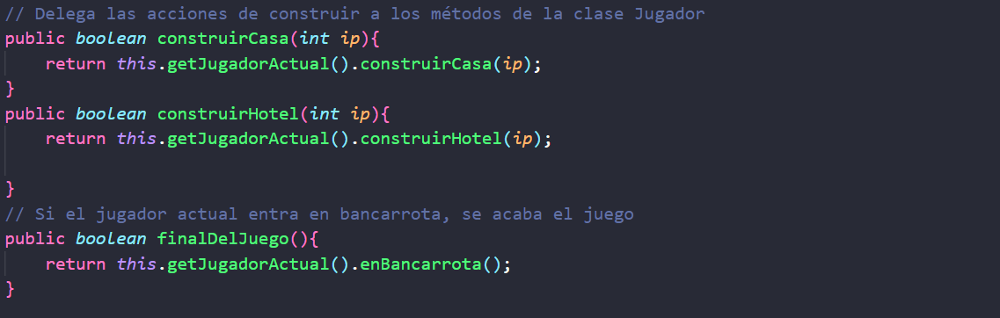